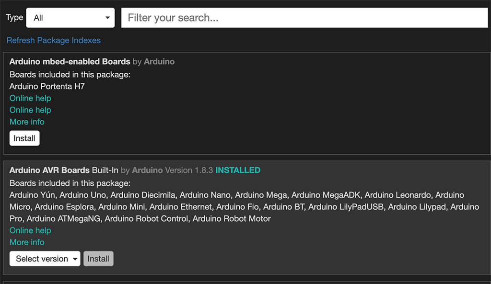
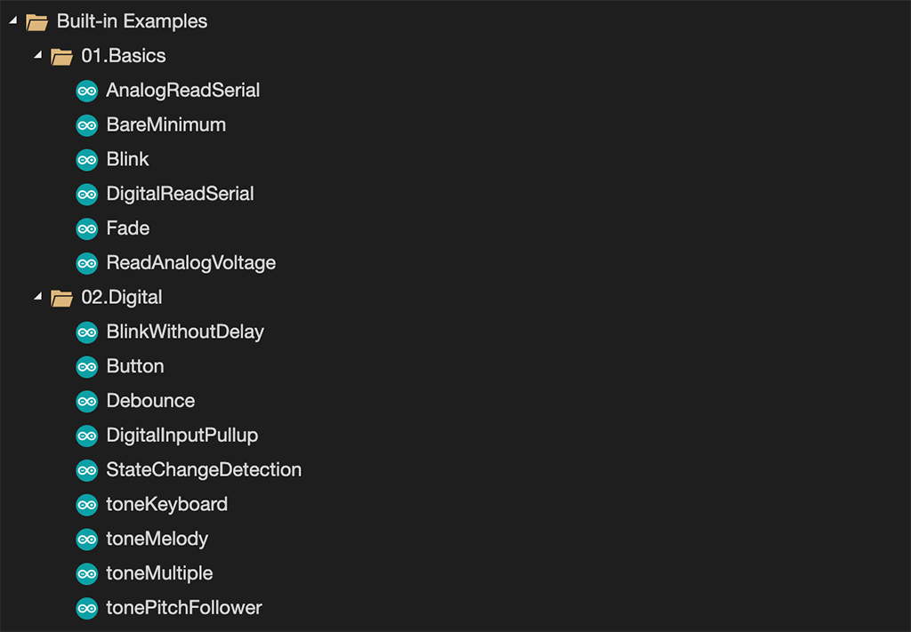
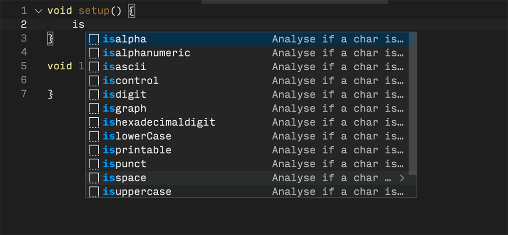

# Arduino Extension Pack

Collection of extensions for working with Arduino devices.

## Extensions Included

* [Arduino](https://marketplace.visualstudio.com/items?itemName=vsciot-vscode.vscode-arduino) - Arduino for Visual Studio Code
* [PlatformIO IDE](https://marketplace.visualstudio.com/items?itemName=platformio.platformio-ide) - Development environment for Embedded, IoT, Arduino, CMSIS, ESP-IDF, FreeRTOS, libOpenCM3, mbedOS, Pulp OS, SPL, STM32Cube, Zephyr RTOS, ARM, AVR, Espressif (ESP8266/ESP32), FPGA, MCS-51 (8051), MSP430, Nordic (nRF51/nRF52), PIC32, RISC-V, STMicroelectronics (STM8/STM32), Teensy
* [arduino-snippets](https://marketplace.visualstudio.com/items?itemName=ronaldosena.arduino-snippets) - Code snippets for arduino

## PlatformIO IDE

## Board Manager

## Examples

## Arduino Snippets

**Enjoy!**

Arduino brands and logos published in the website are Trademarks of Arduino AG.
